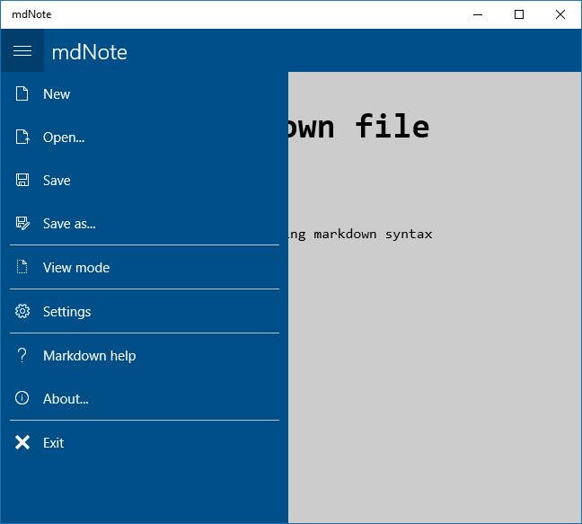
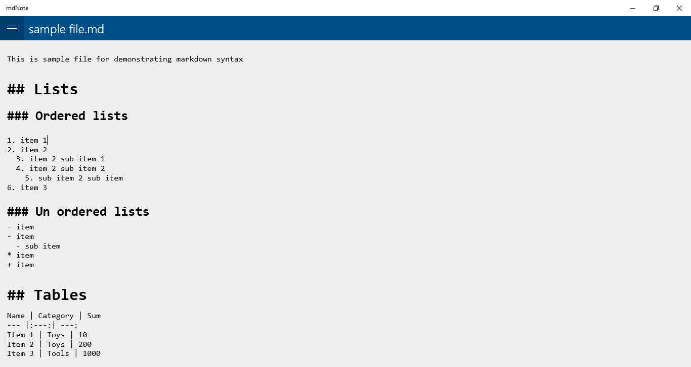
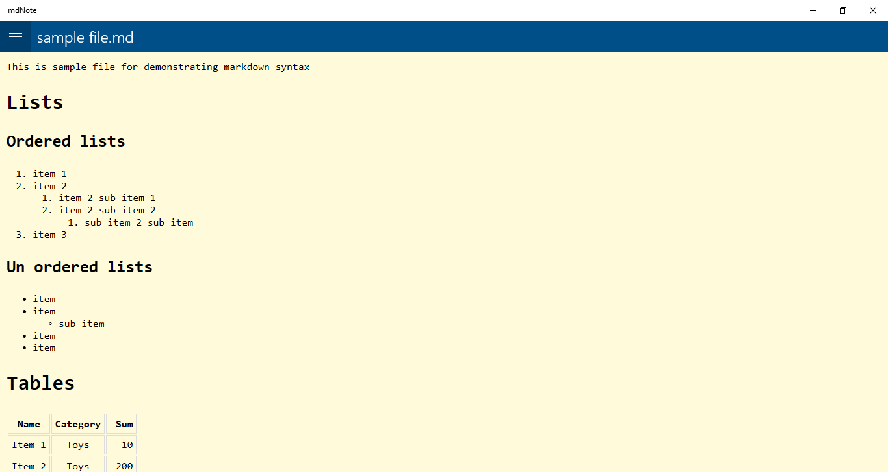
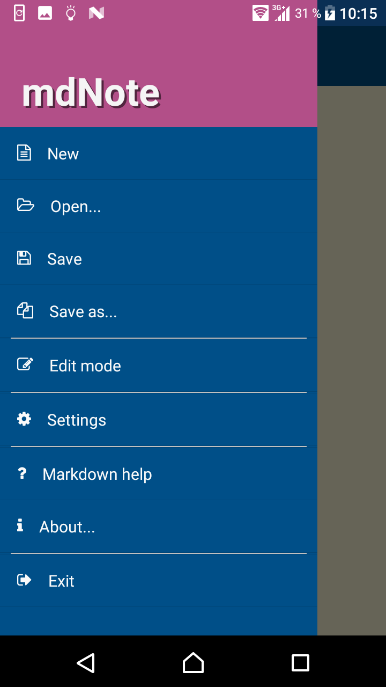
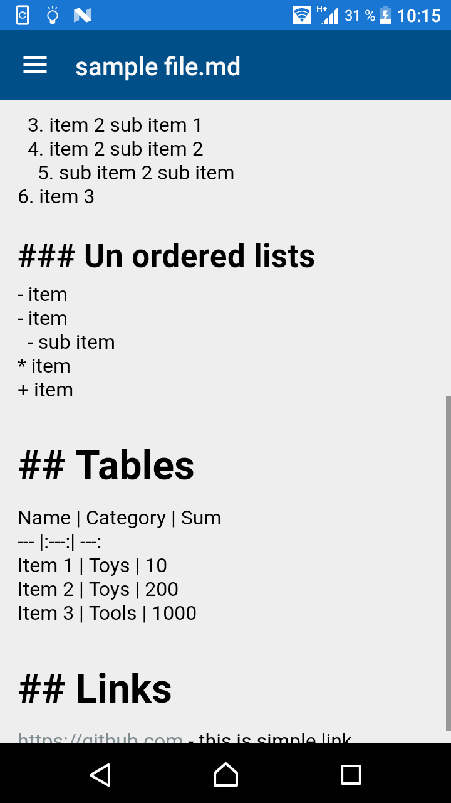
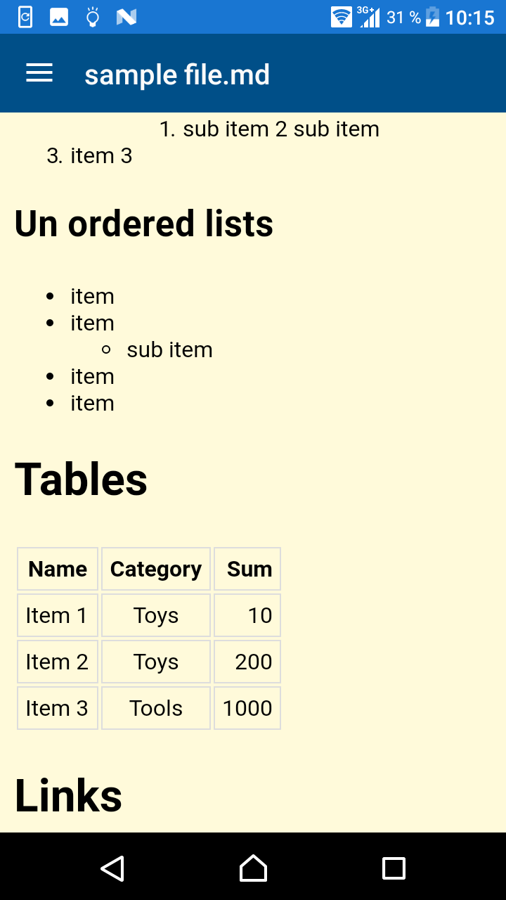

# mdNote

mdNote is WYSIWYG markdown editor for Android(4+) and Windows 10. 

## Features

1. Fast, simple and clean WYSIWYG markdown editor
2. View/edit mode
3. Ajustable fonts and colors
4. Supporting "Send to" operation system action
5. One application for both Windows and Android platforms

## Screenshots

### Windows

### Android

## Privacy policy

mdNote use your local files for viewing and editing purposes and don't collect and send them anywhere.

## History

One day I've decided to move all my personal notes to markdown files. Fast search showed, that there is no well featured software on Android to work with markdown, so I'm started this project.

Because I'm intersting in cross-platform development, this application works both in Android and Windows 10 (UWP application).

## Future plans

1. Localizations
2. Using hot keys

## What's inside

mdNote based on SimpleMDE Markdown Editor and builded using Xamarin.Forms.

Android version using FontAwesome for icons.
